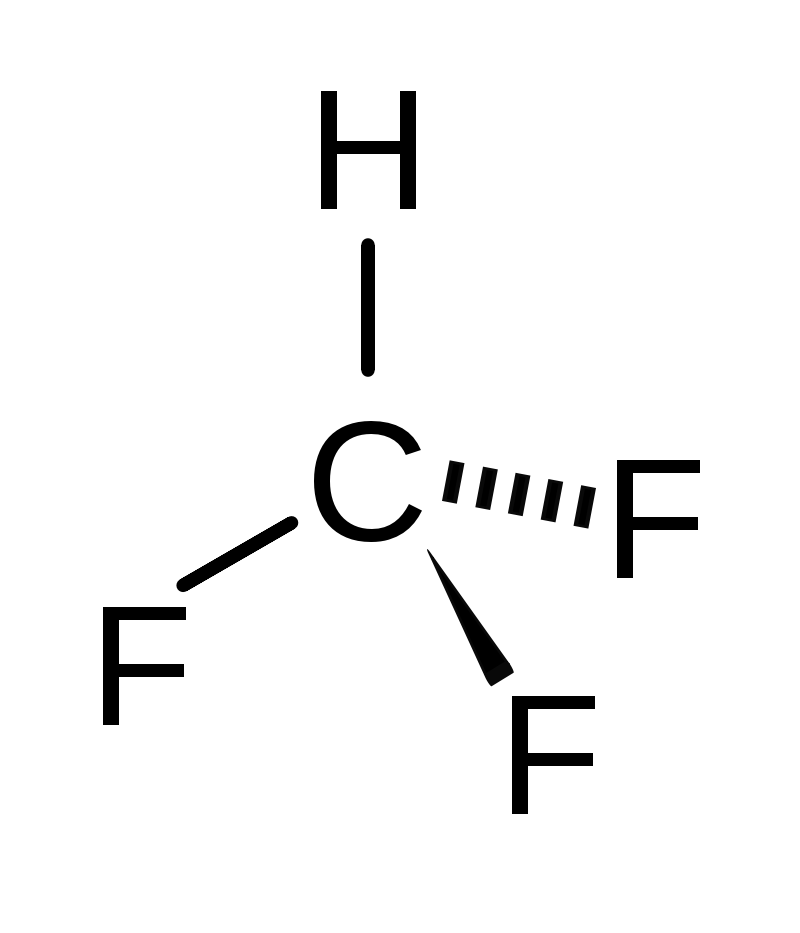
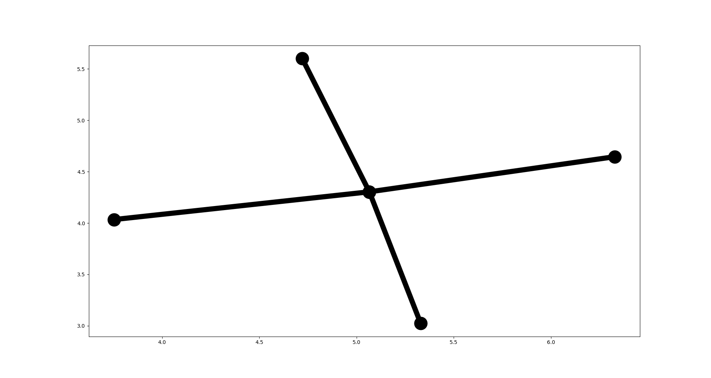
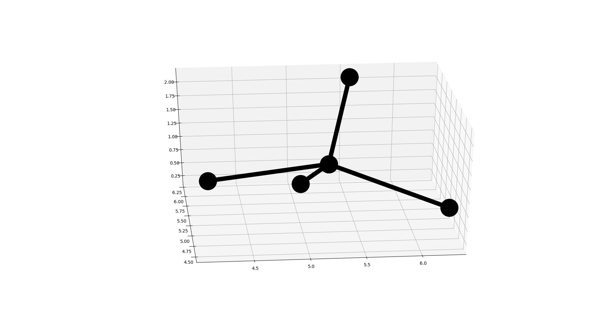
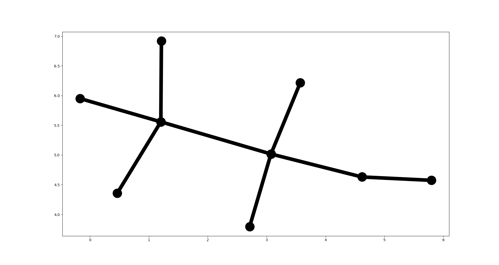
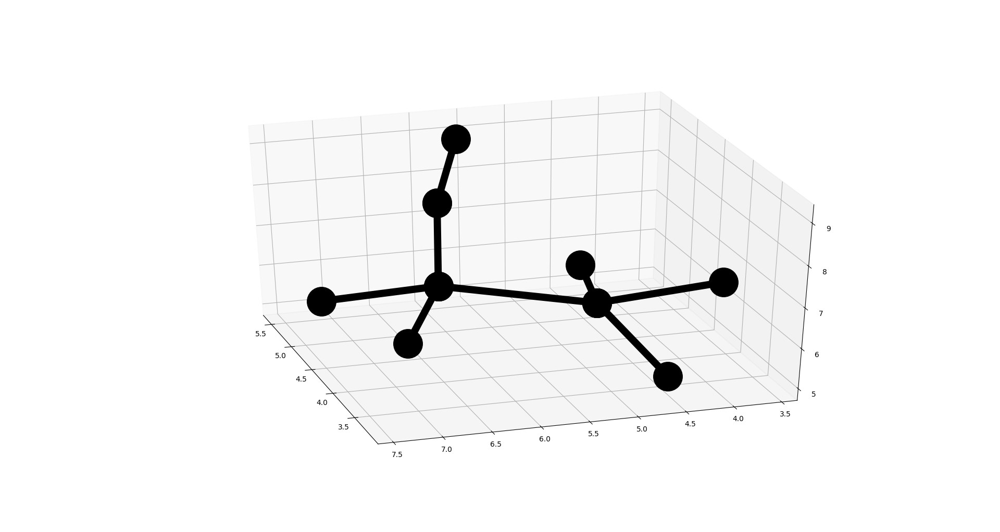
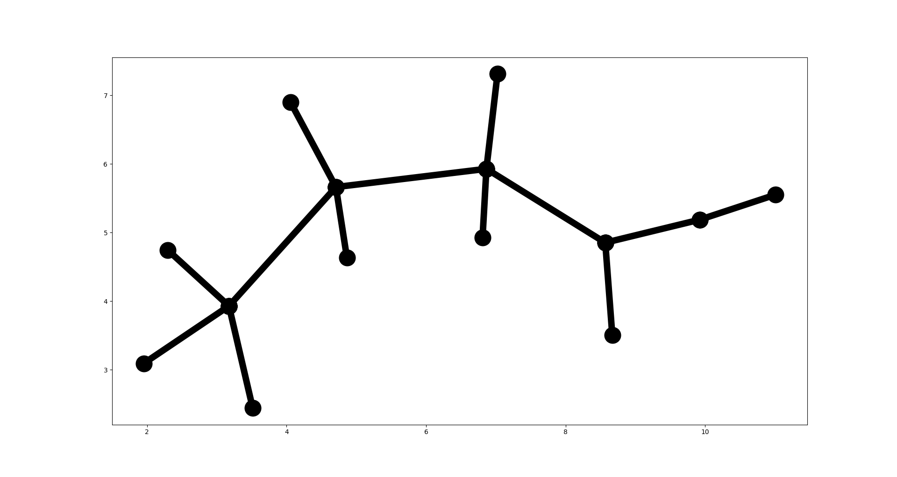
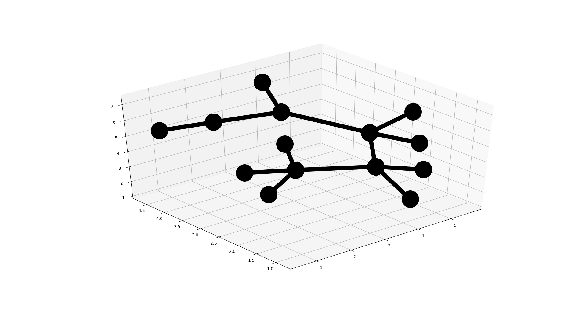
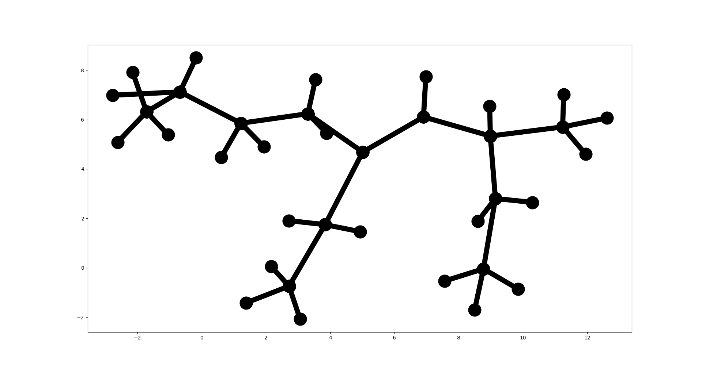
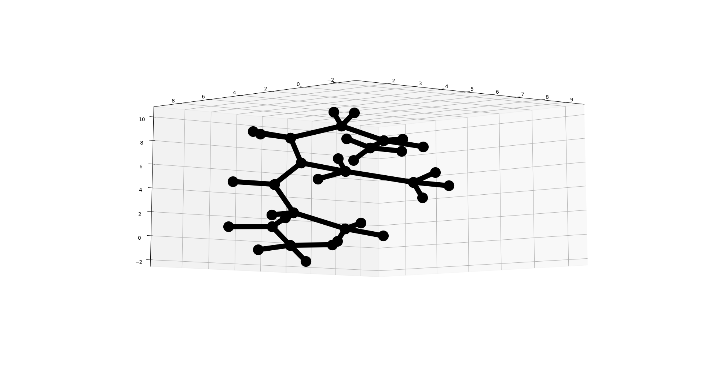

## Structure formulas drawing

The repository contains implementation of [Force-Directed Graph drawing algorithm](http://cs.brown.edu/people/rtamassi/gdhandbook/chapters/force-directed.pdf) for 2D and 3D visualization of structural formulas of chemicals.

This is MIPT [Data Visualisation course](https://www.dainiak.com/teaching/courses/dataviz/) assignment.

### Dependencies

* _Python >= 3.5_
* _Matplotlib >= 2.1.0_
* _Numpy >= 1.15.4_

To install required libraries run the following:

`pip3 install -r requirements.txt`

### How to run

To draw structure formula run:

`python3 ./src/main.py -c <config_file> -m <mode> -f <formula>`

Where 
* _<config_file>_ - path to json config file with algorithm parameters (`data/config.json`)
* _\<mode>_ - 2D or 3D mode
* _\<formula>_ - chemical formula in pseudo SMILE notation

**What is pseudo SMILE notation**

It's smiplified [SMILE](https://ru.wikipedia.org/wiki/SMILES) notation which serves to encode graph of structure formula.

The formula contains of chemical elements (only letter are supported) and round brackets.
It is obtained from structure formula graph by depth traversal. Every symbol except round brackets corresponds to a single vertex.
Round brackets mean graph branching.

For example [fluoroform](https://en.wikipedia.org/wiki/Fluoroform) in pseudo SMILE notation looks like: _C(H)(F)(F)(F)_

Or [ethanol](https://en.wikipedia.org/wiki/Ethanol): _C(H)(H)(H)C(H)(H)OH_

### Experiments

* **[Fluoroform](https://en.wikipedia.org/wiki/Fluoroform):** _C(H)(F)(F)(F)_

2D                                   |3D
:-----------------------------------:|:-----------------------------------:
  |  

* **[Ethanol](https://en.wikipedia.org/wiki/Ethanol):** _C(H)(H)(H)C(H)(H)OH_

2D                                 |3D
:---------------------------------:|:-----------------------------------:
  |  

* **[Isobutyric acid](https://en.wikipedia.org/wiki/Isobutyric_acid):** _C(H)(H)(H)C(H)(H)C(H)(H)C(O)(OH)_

2D                                         |3D
:-----------------------------------------:|:-----------------------------------------:
  |  

* **[(4E)-5-Ethyl-3-methyl-4-nonene](http://www.chemspider.com/Chemical-Structure.9919744.html):**  
_C(H)(H)(H)C(H)(H)C(H)(C(H)(H)(H))C(H)C(C(H)(H)C(H)(H)(H))C(H)(H)C(H)(H)C(H)(H)C(H)(H)(H)_

2D                                                      |3D
:------------------------------------------------------:|:------------------------------------------------------:
  |  
